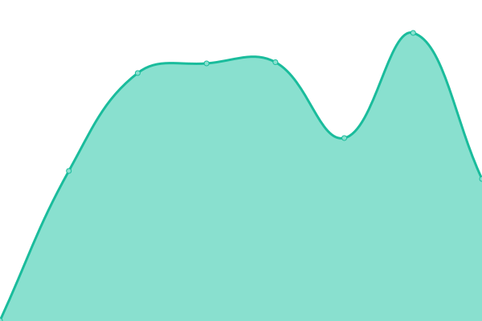
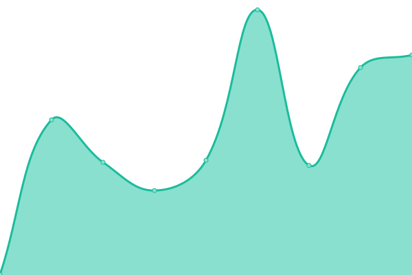

# [📈 Live Status](https://fleck.siteauditpro.com.au): <!--live status--> **🟩 All systems operational**

This repository contains the open-source uptime monitor and status page for [Edward Cox](https://fleck.siteauditpro.com.au), powered by [Upptime](https://github.com/upptime/upptime).

With [Upptime](https://upptime.js.org), you can get your own unlimited and free uptime monitor and status page, powered entirely by a GitHub repository. We use [Issues](https://github.com/edwardcox/scintera/issues) as incident reports, [Actions](https://github.com/edwardcox/scintera/actions) as uptime monitors, and [Pages](https://fleck.siteauditpro.com.au) for the status page.

<!--start: status pages-->
<!-- This summary is generated by Upptime (https://github.com/upptime/upptime) -->
<!-- Do not edit this manually, your changes will be overwritten -->
<!-- prettier-ignore -->
| URL | Status | History | Response Time | Uptime |
| --- | ------ | ------- | ------------- | ------ |
|  [scintera.com.au](https://scintera.com.au) | 🟩 Up | [scintera-com-au.yml](https://github.com/edwardcox/scintera/commits/HEAD/history/scintera-com-au.yml) | 

 571ms
     
 | 

<a href="https://scintera.siteauditpro.com.au/history/scintera-com-au">100.00%</a>
    

|  [Shopify](https://shopify.com) | 🟩 Up | [shopify.yml](https://github.com/edwardcox/scintera/commits/HEAD/history/shopify.yml) | 

 2072ms
     
 | 

<a href="https://scintera.siteauditpro.com.au/history/shopify">99.70%</a>
    

|  [Shopify Accounts](https://accounts.shopify.com) | 🟩 Up | [shopify-accounts.yml](https://github.com/edwardcox/scintera/commits/HEAD/history/shopify-accounts.yml) | 

 241ms
     
 | 

<a href="https://scintera.siteauditpro.com.au/history/shopify-accounts">100.00%</a>
    

|  [Shopify Admin Area](https://scintera-pty-ltd.myshopify.com/admin) | 🟩 Up | [shopify-admin-area.yml](https://github.com/edwardcox/scintera/commits/HEAD/history/shopify-admin-area.yml) | 

 331ms
     
 | 

<a href="https://scintera.siteauditpro.com.au/history/shopify-admin-area">100.00%</a>
    

|  [CloudFlare (DNS and CDN)](https://cloudflare.com) | 🟩 Up | [cloud-flare-dns-and-cdn.yml](https://github.com/edwardcox/scintera/commits/HEAD/history/cloud-flare-dns-and-cdn.yml) | 

 202ms
     
 | 

<a href="https://scintera.siteauditpro.com.au/history/cloud-flare-dns-and-cdn">100.00%</a>
    

|  [Google DNS 1](8.8.4.4) | 🟩 Up | [google-dns-1.yml](https://github.com/edwardcox/scintera/commits/HEAD/history/google-dns-1.yml) | 

 5ms
     
 | 

<a href="https://scintera.siteauditpro.com.au/history/google-dns-1">100.00%</a>
    

|  [Google DNS 2](8.8.8.8) | 🟩 Up | [google-dns-2.yml](https://github.com/edwardcox/scintera/commits/HEAD/history/google-dns-2.yml) | 

 5ms
     
 | 

<a href="https://scintera.siteauditpro.com.au/history/google-dns-2">100.00%</a>
    

<!--end: status pages-->

[**Visit our status website →**](https://fleck.siteauditpro.com.au)

## 📄 License

- Powered by: [Upptime](https://github.com/upptime/upptime)
- Code: [MIT](./LICENSE) © [Edward Cox](https://fleck.siteauditpro.com.au)
- Data in the `./history` directory: [Open Database License](https://opendatacommons.org/licenses/odbl/1-0/)
